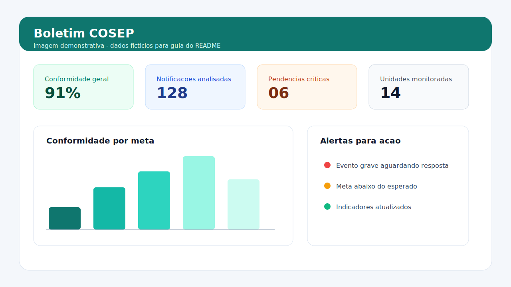
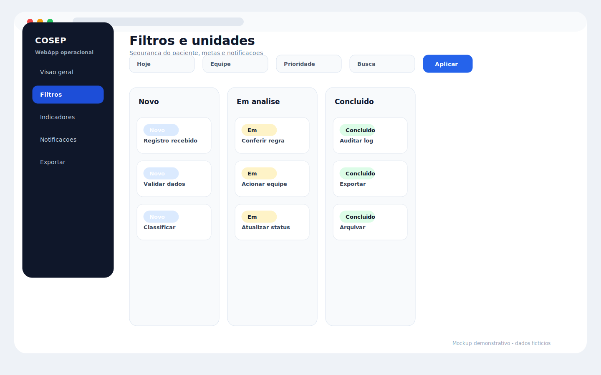
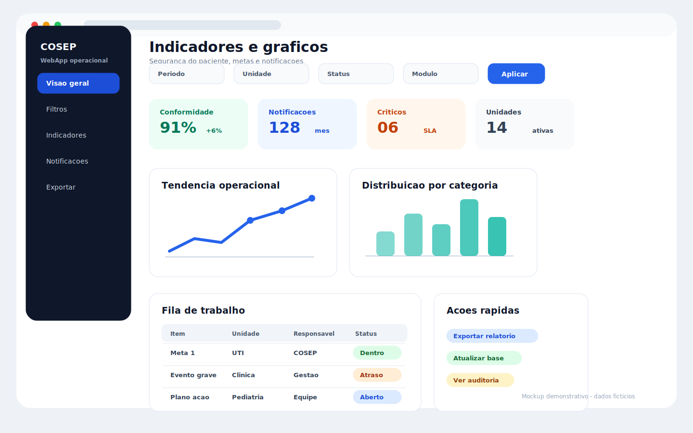

# 🏥 Boletim COSEP

Sistema web para monitoramento de **segurança do paciente** com foco em indicadores assistenciais, conformidade por meta institucional e análise de notificações.

> Projeto desenvolvido com **Google Apps Script + Google Sheets + WebApp** para transformar uma base operacional em um painel executivo, com leitura rápida, filtros inteligentes e apoio à tomada de decisão.

---

## 📌 Descrição objetiva

O **Boletim COSEP** consolida dados de caminhadas de segurança e notificações em um único ambiente visual, permitindo acompanhar performance por unidade, mês e ano, além de identificar pontos críticos com agilidade.

A aplicação atua como camada de produto sobre a planilha: a equipe consulta, filtra e interpreta os dados pelo WebApp, sem depender da navegação manual na base.

---

## ❗ Problema que o sistema resolve

Em rotinas de qualidade assistencial, é comum existir:

- dados dispersos em abas e colunas extensas;
- consolidação manual para reuniões e relatórios;
- dificuldade para comparar períodos e unidades;
- risco de erro humano na apuração de indicadores;
- baixa visibilidade sobre notificações graves e prazo de resposta.

O Boletim COSEP resolve isso ao padronizar a leitura dos dados e entregar indicadores prontos para análise operacional e gerencial.

---

## ⚙️ Principais funcionalidades

- **Painel único de indicadores** para caminhadas e notificações.
- **Filtros avançados** por ano, mês e unidade (com filtros independentes por módulo).
- **Cálculo de conformidade** por metas de segurança do paciente.
- **Classificação por situação de meta** (atingida vs. oportunidades de melhoria).
- **Consolidação de notificações** com distribuição por unidade e tipo.
- **Resumo de prazo de resposta** para classificações críticas (ex.: evento adverso grave / óbito / never event).
- **Normalização e padronização de dados** (mês, texto, unidade, data).
- **Interface responsiva e visual moderna** com foco em leitura rápida por gestores e times assistenciais.

---

## 🧰 Tecnologias utilizadas

### Back-end
- **Google Apps Script (V8)**
- **Google Sheets** como base de dados operacional
- **ContentService / HtmlService** para API JSON + entrega do WebApp

### Front-end
- **HTML5 + CSS3 + JavaScript**
- **Chart.js** para visualização gráfica
- **Font Awesome** para ícones
- **Google Fonts (Inter)** para tipografia

---

## 🗂️ Estrutura do projeto

```bash
.
├── Code.gs        # Lógica de negócio, filtros, consolidação e payload JSON
├── Index.html     # Interface web, visual, componentes e gráficos
└── README.md      # Documentação técnica do projeto
```

---

## 🔄 Fluxo de funcionamento

1. O usuário acessa o WebApp publicado.
2. A interface solicita os dados via endpoint (`?api=1`) no próprio Apps Script.
3. O back-end:
   - lê a planilha base;
   - aplica filtros recebidos (anos/meses/unidades);
   - processa caminhadas e notificações;
   - calcula métricas e resumos;
   - devolve o payload em JSON.
4. O front-end renderiza KPIs, tabelas e gráficos.
5. A equipe analisa desvios, prioridades e desempenho por recorte operacional.

---

## 🖼️ Capturas de tela

> Imagens demonstrativas para guiar a apresentação do projeto. Os dados exibidos são fictícios e não representam informações reais de pacientes ou da instituição.

### Tela inicial do painel


### Filtros e visão por unidade


### Indicadores e gráficos


---

## ▶️ Como executar

### Pré-requisitos
- Conta Google com acesso ao Google Apps Script.
- Planilha Google com abas e estrutura de colunas esperadas pelo sistema.

### Passo a passo

1. Crie um projeto no **Google Apps Script**.
2. Adicione os arquivos do repositório:
   - `Code.gs`
   - `Index.html`
3. Atualize, se necessário, as constantes de configuração no `Code.gs`:
   - `ID_PLANILHA`
   - nomes das abas (`ABA_CAMINHADAS`, `ABA_NOTIFICA`)
   - `FUSO_HORARIO`
4. Implante como **Web App**:
   - Executar como: você (proprietário)
   - Acesso: conforme política da instituição
5. Abra a URL gerada e valide filtros, gráficos e totais.

---

## 🚀 Melhorias futuras

- Controle de perfis (gestão, coordenação, auditoria).
- Exportação de relatórios em PDF com layout institucional.
- Histórico de tendências com comparação automática entre períodos.
- Alertas proativos para queda de conformidade e atraso de resposta.
- Camada de auditoria (quem alterou, quando e o que mudou na base).
- Catálogo de indicadores com metas parametrizáveis por unidade.

---

## 👤 Autor

**Vinícius Oliveira**  
Sistema desenvolvido para gestão operacional de segurança do paciente com foco em confiabilidade dos dados, automação de análises e apoio à decisão.

---

Se este projeto te ajudou, fique à vontade para abrir uma issue com sugestões de evolução. 🤝