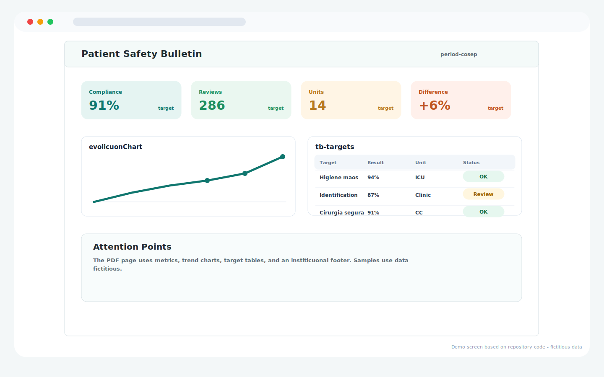
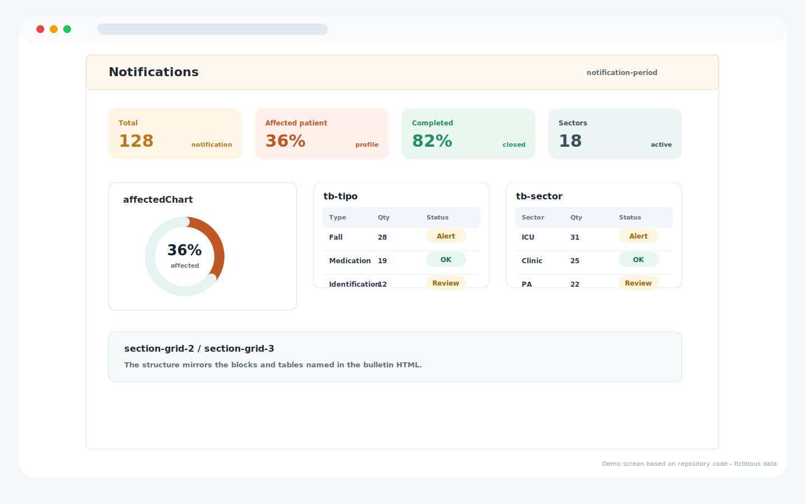

# Patient Safety Analytics

Repository: `patient-safety-analytics`

## Overview

Web dashboard for patient safety indicators, COSEP safety walks, notifications, institutional targets, and PDF-ready report pages.

## Main Capabilities

- Separated filter surfaces for COSEP safety walks and notifications.
- Patient safety KPI cards, trend charts, target tables, and attention points.
- Notification analytics by affected patient, completion status, event type, and sector.
- Institutional report pages prepared for PDF export.

## Operating Flow

1. The user selects year, unit, and notification filters.
2. The app validates the minimum filter set and updates the selection summary.
3. COSEP and notification report pages are rendered with fictitious sample data in the guide.
4. The generated report can be exported with the institutional layout.

## Visual System Guide

> The screens below are documentation mockups based on the components, labels, colors, and workflows found in this repository. All displayed data is fictitious and does not represent real patients, staff members, or institutions.

### Bulletin - COSEP and notification filters

### Bulletin - COSEP report page

### Bulletin - notifications report page

## Data Privacy

The repository documentation and guide images use fictitious sample data only.

## Technologies

- JavaScript
- HTML/CSS
- Google Apps Script
- Google Sheets

## Status

Completed
